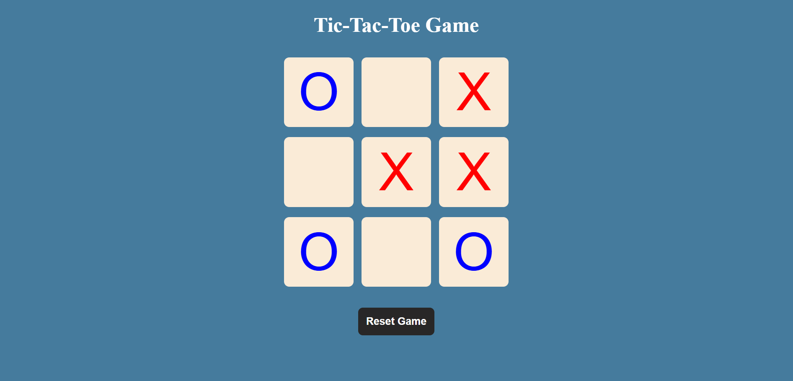

# ❌⭕ Tic Tac Toe Game

This is a simple Tic Tac Toe game built using **HTML**, **CSS**, and **JavaScript**. The game allows two players to take turns marking "O" and "X" on a 3x3 grid, with logic to detect wins, draws, and reset the game.

---

## ✨ Features

- 🕹️ Two-player gameplay ("O" vs "X")
- 🧠 Smart win and draw detection
- 🔁 Reset and New Game buttons
- 💻 Fully responsive and user-friendly UI
- 🎉 Dynamic messages for win/draw scenarios

---

## How to Play

1. Click any empty box to place your mark ("O" or "X").
2. Players alternate turns automatically.
3. The game checks for a winner after every move.
4. If a player wins, a message is displayed and the game disables further moves.
5. If all boxes are filled without a winner, the game declares a draw.
6. Use the "Reset" or "New Game" button to start over.

---

## 🚀 Technologies Used

- HTML5  
- CSS3  
- JavaScript 

## 🖼️ Preview (<a href="https://shivam0713.github.io/Tic-Tac-Toe-Game/">View Live</a>)



> Replace the preview image and link with your hosted project URL and an actual screenshot.

## 📂 Project Structure

```plaintext
TicTacToe/
│
├── index.html        # HTML structure of the game
├── style.css         # Styling and layout
├── script.js         # Game logic and functionality
├── screenshot.png    # Game screenshot with live view link
└── README.md         # Project documentation

```
